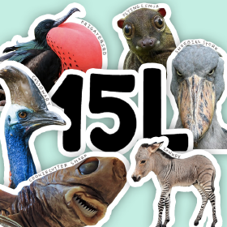

# Lab 1
## W 4-6 pm
*CSe 15l* is an interesting class and the **link** to this website is [Link](https://ucsd-cse15l-f23.github.io/)




> In this lab we’ll make a professional website for yourself where you can post your lab reports for the course. 
* **Part 1: Meet Your Group**
1. *Name*
2. *Major*
3. *Favourite place*
* **Part 2: Create our own workspace**
* **Part 3: Crete our own Github page**


---
My thought:
I think the interaction between group members is very interesting!

`git clone https://github.com/ucsd-cse15l-f23/lecture1` helps me download the code from GitHub.

```
# create a new file
touch ja.txt
```

Touch commands help me to create a new file.


