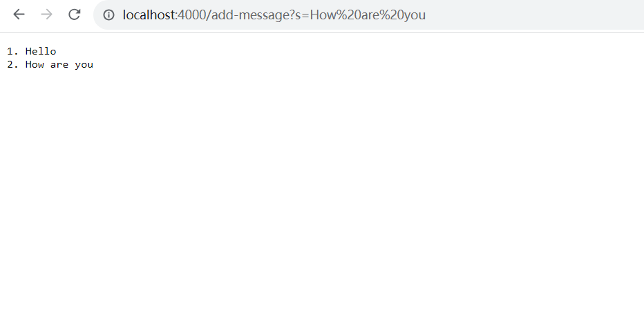
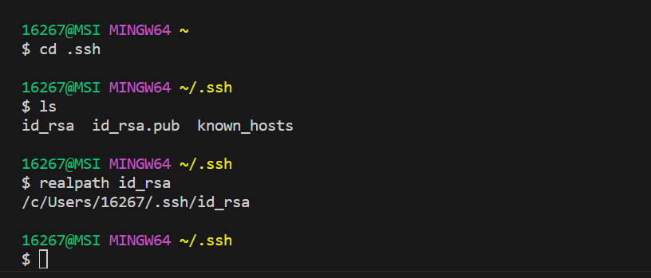

# Lab Report 2 - Week 3 - VSCode and Your Local Machine
## Part 1
**Below is the code for my StringServer:**
```
import java.io.IOException;
import java.net.URI;

class Handler implements URLHandler {
     String str = "";
     static int i = 1;
     public String handleRequest(URI url) {
    if (url.getPath().contains("/add-message")) {
        String[] parameters = url.getQuery().split("=");
        if (parameters[0].equals("s")) {
            str += String.valueOf(i)+". "+parameters[1] +"\n";
            i++;
            }
            return str;
        }
        else
         return "404 Not Found!";
    }
        
}

public class StringServer {
    public static void main(String[] args) throws IOException {
        if(args.length == 0){
            System.out.println("Missing port number! Try any number between 1024 to 49151");
            return;
        }

        int port = Integer.parseInt(args[0]);

        Server.start(port, new Handler());
    }

}


```
---

**Below is my first screenshot of using /add-message:**


---

1. Which methods in your code are called?
   
   **The main method in the StringServer class, Server.start(), and the handleRequest method in the Handler class are called.**

   
2. What are the relevant arguments to those methods, and the values of any relevant fields of the class?
   
   **1. Main method in the StringServer class:**
   
   **Relevant arguments: args**
   
   **It does not have any relevant fields of the class, it only has local variable.**:

   **2. Server.start():**
   
   **Relevant arguments: int port, URLHandler handler**

   **It does not have any fields.**

   **Note: the code of this method is not in the StringServer.java.**

   **3. handleRequest method in the Handler class:**
   
   **Relevant arguments: URI url**
   
   **Values of relevant fields: string str = "", static int i = 1**

3. How do the values of any relevant fields of the class change from this specific request? If no values got changed, explain why.
   
   **string str changes from "" to "1. Hello\n". static int i changes from 1 to 2.**

---

**Below is my second screenshot of using /add-message:**



---
1. Which methods in your code are called?
   
   **The main method in the StringServer class, Server.start(), and the handleRequest method in the Handler class are called.**

2. What are the relevant arguments to those methods, and the values of any relevant fields of the class?
   
   **1. Main method in the StringServer class:**
   
   **Relevant arguments: args**
   
   **It does not have any relevant fields of the class, it only has local variable.**:

   **2. Server.start():**
   
   **Relevant arguments: int port, URLHandler handler**

   **It does not have any fields.**

   **3. handleRequest method in the Handler class:**
   
   **Relevant arguments: URI url**
   
   **Values of relevant fields: string str = "1. Hello", static int i = 2**

3. How do the values of any relevant fields of the class change from this specific request? If no values got changed, explain why.
   
   **string str changes from "1. Hello\n" to "1. Hello\n2. How are you\n". static int changes from 2 to 3.**

---
## Part 2

1. The path to the private key for your SSH key for logging into ieng6 (on my computer or on the home directory of the lab computer):



2. The path to the public key for your SSH key for logging into ieng6 (within my account on ieng6):


3. A terminal interaction where you log into ieng6 with your course-specific account without being asked for a password:


---

## Part 3

In a couple of sentences, describe something you learned from lab in week 2 or 3 that you didn’t know before:

**In week 2, I learned how to use the ssh command to connect to the remote server. It is new to me. Even if I am at home and cannot connect to the UCSD-Protected network, I can use the ssh command to test
if my web server can load the ieng6-20x URLs. In week 3, I learned how to log into ieng6 without typing the password. It can save a lot of time.**
