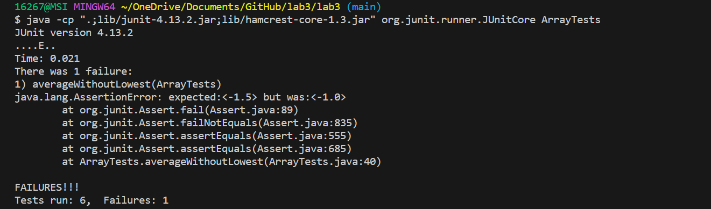

# Lab Report 3 - Bugs and Commands (Week 5)


## Part 1 - Bugs


**Choose one of the bugs from week 4’s lab:**


I chose the bug of the averageWithoutLowest method from the ArrayExamples.java.


**Provide:**


* **A failure-inducing input for the buggy program, as a JUnit test and any associated code (write it as a code block in Markdown):**
  

The associated code in the ArrayTests.java:

```
 @Test
  public void averageWithoutLowest() {
    double [] input1 = {-1.0, -2.0, -3.0, -3.0};
    double expected = -1.5;
    assertEquals(expected, ArrayExamples.averageWithoutLowest(input1), 0.01);
  }
```
---

* **An input that doesn’t induce a failure, as a JUnit test and any associated code (write it as a code block in Markdown):**
The associated code in the ArrayTests.java:

```
@Test
  public void averageWithoutLowest2() {
    double [] input1 = {1.0, 2.0, 4.0};
    double expected = 3.0;
    assertEquals(expected, ArrayExamples.averageWithoutLowest(input1), 0.01);
  }
```
---

* **The symptom, as the output of running the tests:(provide it as a screenshot of running JUnit with at least the two inputs above):**

 

 ---

* **The bug, as the before-and-after code change required to fix it (as two code blocks in Markdown):**

Before the change:

```
  // Averages the numbers in the array (takes the mean), but leaves out the
  // lowest number when calculating. Returns 0 if there are no elements or just
  // 1 element in the array
  static double averageWithoutLowest(double[] arr) {
    if(arr.length < 2) { return 0.0; }
    double lowest = arr[0];
    for(double num: arr) {
      if(num < lowest) { lowest = num; }
    }
    double sum = 0;
    for(double num: arr) {
      if(num != lowest) { sum += num; }
    }
    return sum / (arr.length - 1);
  }
```

---
After the change:

```
static double averageWithoutLowest(double[] arr) {
    if(arr.length < 2) { return 0.0; }
    double lowest = arr[0];
    int countLowest = 0;

    for(double num: arr) {
      if(num < lowest) {lowest = num;}
    }

    for(double num: arr) {
      if(num == lowest) {countLowest++;}
    }
 
    double sum = 0;

    for(double num: arr) {
      if(num != lowest) { sum += num; }
    }
    
    return sum / (arr.length - countLowest);
  }

```
---

**Briefly describe why the fix addresses the issue.**

  In the previous code, it was assumed that there was only one lowest number in the array. After finding the lowest number in the array, I used a for loop to count its occurrences. It allows me to 
calculate the actual average without the lowest numbers of the array. During the calculation, I excluded all the lowest numbers. Therefore, this fix can address the issue.

---

## Part 2 - Researching Commands

**Consider the commands less, find, and grep. Choose one of them. Online, find 4 interesting command-line options or alternate ways to use the command you chose.**

I choose the find command. 

1.  Find Files Using Name and Ignoring Case: -iname option with find command.

Source: [Link](https://www.tecmint.com/35-practical-examples-of-linux-find-command/)
   
**For each of those options, give 2 examples of using it on files and directories from ./technical. Show each example as a code block that shows the command and its output.**

* First example:
```
16267@MSI MINGW64 ~/OneDrive/Documents/GitHub/lab5/docsearch/technical (main)
$ find . -iname may*.txt
./government/Gen_Account_Office/May1998_ai98068.txt
```

**Write a sentence or two about what it’s doing and why it’s useful.**

  This command finds any files that match the pattern "may*txt" starting in the current directory (technical) and its subdirectories. It ignores the case sensitivity. It is useful when I am unsure about the casing of the filenames.

* Second example:
```
16267@MSI MINGW64 ~/OneDrive/Documents/GitHub/lab5/docsearch/technical (main)
$ find . -iname "*gen*"
./government/Env_Prot_Agen
./government/Gen_Account_Office
./government/Media/agency_expands.txt
./government/Media/BergenCountyRecord.txt
./government/Media/Federal_agency.txt
./government/Media/Greedy_Generous.txt
./government/Media/Service_Agency.txt
```

**Write a sentence or two about what it’s doing and why it’s useful.**

  This command finds any files or directories that match the pattern "\*gen\*" starting in the current directory (technical) and its subdirectories. It ignores the case sensitivity. It is useful when I am dealing with files or directories with inconsistent naming conventions.

---

2.  Find and Remove Single File: -exec option with find command.

Source: [Link](https://www.tecmint.com/35-practical-examples-of-linux-find-command/)
   
   **For each of those options, give 2 examples of using it on files and directories from ./technical. Show each example as a code block that shows the command and its output.**
   
   * First example:
      ```
      16267@MSI MINGW64 ~/OneDrive/Documents/GitHub/lab5/docsearch/technical (main)
      $ find . -type f -name "test.txt" -exec rm -f {} \;
      ```

**Write a sentence or two about what it’s doing and why it’s useful.** 
   
  I created a file and its name is test.txt. This command finds the file "test.txt" starting in the current directory and its subdirectories, and removes each file it finds. It is useful because the "exec" option allows the removal command "rm -f" to be executed.

* Second example:
```
16267@MSI MINGW64 ~/OneDrive/Documents/GitHub/lab5/docsearch/technical (main)
$ find . -type d -name "empty-directory" -exec rm -r {} \;
```

**Write a sentence or two about what it’s doing and why it’s useful.**

 I created an empty directory and its name is empty-directory. This command finds the directory "empty-directory" starting in the current directory and its subdirectories, and removes each directory it finds. It is useful because the "exec" option allows the removal command "rm -r" to be executed.

---


3. Find all Empty Files: -empty option with find command.

Source: [Link](https://www.tecmint.com/35-practical-examples-of-linux-find-command/)
     
**For each of those options, give 2 examples of using it on files and directories from ./technical. Show each example as a code block that shows the command and its output.**

* First example:
```
16267@MSI MINGW64 ~/OneDrive/Documents/GitHub/lab5/docsearch/technical (main)
$ find . -type f -empty
./test.txt       
```
**Write a sentence or two about what it’s doing and why it’s useful.**

I created an empty file with the name "test.txt". This command finds all the empty files starting in the current directory and its subdirectories. It is useful because we can find all the empty files in a directory efficiently.

* Second example:
```
16267@MSI MINGW64 ~/OneDrive/Documents/GitHub/lab5/docsearch/technical (main)
$ find . -type d -empty
./empty
```
**Write a sentence or two about what it’s doing and why it’s useful.**

I created an empty directory with the name "empty". This command finds all the empty directories starting in the current directory and its subdirectories. It is useful because we can find all the empty directories in a directory efficiently.

---

4.   Find files based on modification time: -mmin option with find command.

Source: [Link](https://www.tecmint.com/35-practical-examples-of-linux-find-command/)

**For each of those options, give 2 examples of using it on files and directories from ./technical. Show each example as a code block that shows the command and its output.**

* First example:
```
16267@MSI MINGW64 ~/OneDrive/Documents/GitHub/lab5/docsearch/technical (main)
$ find . -mmin -1
./test.txt
```

**Write a sentence or two about what it’s doing and why it’s useful.**

I just modified the test.txt. This command finds all the files starting in the current directory and its subdirectories which are modified in the last 1 minute. It is useful because we can find a file that was just modified more efficiently.

* Second example:
```
16267@MSI MINGW64 ~/OneDrive/Documents/GitHub/lab5/docsearch/technical (main)
$ find . -type f -mmin -10
./test.txt
./test2.txt
```

**Write a sentence or two about what it’s doing and why it’s useful.**

I just created a new file with the name "test2.txt".  This command finds all the files starting in the current directory and its subdirectories which are modified in the last 10 minutes. It is useful because it helps me to track all files modified in the time frame. If I suspect unauthorized access, I can find them quickly.
