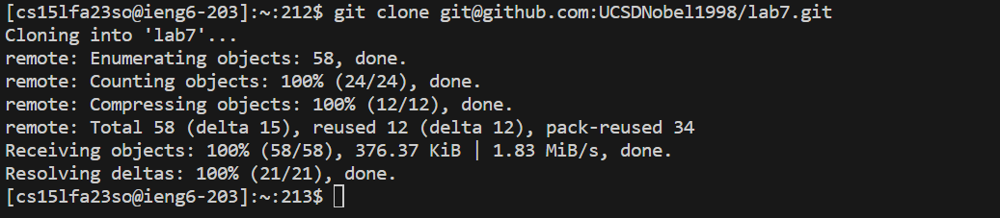

# Lab Report 4 - Vim (Week 7)

**For each numbered step starting right after the timer (so steps 4-9), take a screenshot, and write down exactly which keys I pressed to get to that step. Then, summarize the commands I ran and what the effect of those keypresses were.**

## Step 4: Log into ieng6

Screenshot:

The keys I pressed to get this step:

`ssh cs15lfa23so@ieng6.ucsd.edu<enter>`   I used this command to log in to ieng6. I do not need to type the password.

## Step 5: Clone my fork of the repository from my Github account (using the SSH URL)

Screenshot:

The keys I pressed to get this step:

`git clone git@github.com:UCSDNobel1998/lab7.git<enter>`  I used the SSH url to clone my fork of the repository from my GitHub account.

## Step 6: Run the tests, demonstrating that they fail

Screenshot:

The keys I pressed to get this step:

`cd lab7<enter>`   I changed to lab 7 directory.

`javac -cp .:lib/hamcrest-core-1.3.jar:lib/junit-4.13.2.jar *.java<enter>`  This command compiles all .java files in the current directory, using the current directory (.), Hamcrest, and JUnit libraries as dependencies.

`java -cp .:lib/hamcrest-core-1.3.jar:lib/junit-4.13.2.jar org.junit.runner.JUnitCore L<tab>Tests<enter>` This command runs the ListExamplesTests using JUnit, with the classpath set to include the current directory as well as the Hamcrest and JUnit libraries needed to execute the tests. I used TAB to autocomplete.

## Step 7: Edit the code file to fix the failing test

Screenshot:

The keys I pressed to get this step:

`ls<enter>`  I used this command to see the files in the lab 7 directory.

`vim ListExamples.java<enter>` I used this command to open the file ListExamples.java in vim.

`/index1<enter>nnnnnnnnnce index2<esc>:wq<enter>` I used this command to first search pattern "index1" in the file. Then I pressed n for 9 times to find the index1 which needed to be modified. I pressed ce to delete the index1 and typed index2 to insert. I typed ESC to exit the insert mode. Finally, I typed :wq to save and exit Vim.

`cat ListExamples.java` I used this command to print the content of the file and check whether the modification was successful.

## Step 8: Run the tests, demonstrating that they now succeed

Screenshot:

The keys I pressed to get this step:

`<up><up><up><up><up><enter>` The `javac -cp .:lib/hamcrest-core-1.3.jar:lib/junit-4.13.2.jar *.java` command was 5 up in the search history, so I used up arrow to access it. This command compiles all .java files in the current directory, using the current directory (.), Hamcrest, and JUnit libraries as dependencies.

`java -cp .:lib/hamcrest-core-1.3.jar:lib/junit-4.13.2.jar org.junit.runner.JUnitCore ListExamplesTest<enter>`  This command runs the ListExamplesTests using JUnit, with the classpath set to include the current directory as well as the Hamcrest and JUnit libraries needed to execute the tests.

## Step 9: Commit and push the resulting change to my GitHub account 

Screenshot:

The keys I pressed to get this step:

`git add ListExamples.java<enter>`  I used this command to stage the change I have made for ListExamples.java.

`git commit -m "Update the ListExamples.java"<enter>`  I used this command to commit the change with a message describing what changes I have made.

`git push<enter>`  I used this command to push my commit to GitHub.

