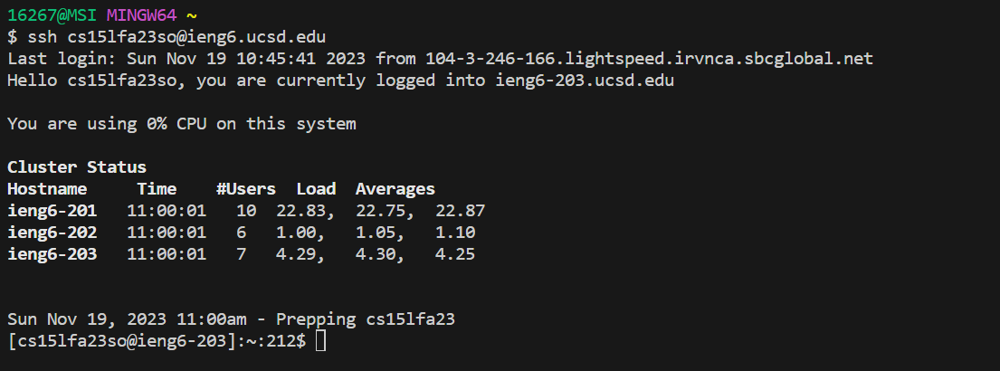

# Lab Report 4 - Vim (Week 7)

**For each numbered step starting right after the timer (so steps 4-9), take a screenshot, and write down exactly which keys you pressed to get to that step.**

## Step 4:Log into ieng6

Screenshot:

The keys I pressed to get this step: 
`ssh cs15lfa23so@ieng6.ucsd.edu`

I do not need to type the password.

## Step 5: Clone your fork of the repository from your Github account (using the SSH URL)

Screenshot:

The keys I pressed to get this step: 
`git clone git@github.com:UCSDNobel1998/lab7.git`

## Step 6: Run the tests, demonstrating that they fail

Screenshot:

 

