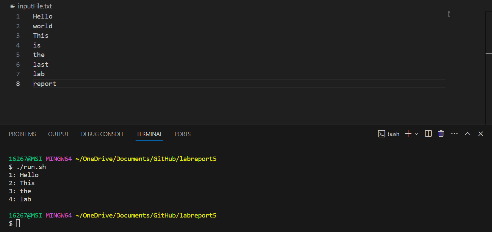
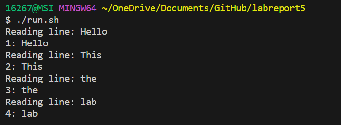

# Lab Report 5 - Putting it All Together (Week 9)

## Part 1 – Debugging Scenario


Design a debugging scenario, and write your report as a conversation on EdStem. It should have:

1.The original post from a student with a screenshot showing a symptom and a description of a guess at the bug/some sense of what the failure-inducing input is. (Don’t actually make the post! Just write the content that would go in such a
 post)

**Original Post on EdStem**

**Title:** Issue with Java Program Output - Need Help Debugging

**Content:** 

> Hi everyone,
> 
> I am currently working on the Java program `MyProgram.java`. I also ran this Java file by using a bash script called `run.sh`. This Java program will read a text file, and print each line numbered. However, there is an odd output. The programming omits some lines on the display.
> 
> Here's a screenshot of my terminal after running `./run.sh`:
> 
> 
>
> Here's the code of my java file:
>
>    ```java
>   import java.io.*;
>   public class MyProgram {
>       public static void main(String[] args) throws IOException {
>           BufferedReader reader = new BufferedReader(new FileReader("inputFile.txt"));
>           String line;
>           int lineNum = 1;
>           while ((line = reader.readLine()) != null) {
>               System.out.println(lineNum + ": " + line);
>               line = reader.readLine(); 
>               lineNum++;
>           }
>           reader.close();
>       }
>   }
>   ```
> 
> It seems like the bug might be related to how the program reads the file or processes the lines. I'm a bit stuck on what could be causing this. Any suggestions on how to debug this would be really helpful!
---


2.A response from a TA asking a leading question or suggesting a command to try (To be clear, you are mimicking a TA here.)
   
**Response from TA:**

> Hi there,
> 
> Thank you for sharing the input.txt and java code. Based on what you said it could probably be a problem of how your program reads lines up on the file. Many lines might go unnoticed by this system.
You could try to insert a print-statement inside your loop just before the value of line. Using this method is possible to find out whether all the lines could be printed. You could add like this:
>
>
> ```java
> while ((line = reader.readLine()) != null) {
>    System.out.println("Reading line: " + line);
>    // rest of your code
>}
> ```
---


3.Another screenshot/terminal output showing what information the student got from trying that, and a clear description of what the bug is.
**Follow-Up Post from Student:**

> Thanks for the suggestion! Here's the output after adding the code:
> 
> 
> 
> I compared this with my program's output and noticed that indeed my program is skipping lines. Here's the bug: ReadLine() is erroneously called twice in the loop, during each loop iteration that ought to read each individual line 
> the file and subsequently print it respectively. An incoming line is read by the first readLine(). Nevertheless, another unexpected readLine() execution occurs before the loop begins yet another iteration. This second call will read
>  the next line but do nothing with it; then, when the loop iterates, this line in the output will be skipped.

---


4.At the end, all the information needed about the setup including:
* The file & directory structure needed
* The contents of each file before fixing the bug
* The full command line (or lines) you ran to trigger the bug
* A description of what to edit to fix the bug


> **Setup Information:**
> - **File & Directory Structure:**
>   - labreport5
>     - MyProgram.java
>     - run.sh
>     - inputFile.txt
> - **Contents of MyProgram.java (before fixing):**
>   ```java
>   import java.io.*;
>   public class MyProgram {
>       public static void main(String[] args) throws IOException {
>           BufferedReader reader = new BufferedReader(new FileReader("inputFile.txt"));
>           String line;
>           int lineNum = 1;
>           while ((line = reader.readLine()) != null) {
>               System.out.println(lineNum + ": " + line);
>               line = reader.readLine(); 
>               lineNum++;
>           }
>           reader.close();
>       }
>   }
>   ```
> - **Contents of run.sh:**
>   ```bash
>   #!/bin/bash
>   javac MyProgram.java
>   java MyProgram
>   ```
>
> - **Contents of inputFile.txt:**
> ```
> Hello
>world
>This
>is
>the
>last
>lab
>report
> ```
> 
> - **Command Line to Trigger the Bug:**
>   ```
>   ./run.sh
>   ```
> - **Fix:**
>   To fix the bug, remove the second call to `reader.readLine()` inside the while loop in `MyProgram.java`.
>
---
## Part 2 – Reflection
In a couple of sentences, describe something you learned from your lab experience in the second half of this quarter that you didn’t know before. It could be a technical topic we addressed specifically, something cool you found out on your own building on labs, something you learned from a tutor or classmate, and so on. It doesn’t have to be specifically related to a lab writeup, we just want to hear about cool things you learned!

**During the latter part of this quarter, I had a really enlightening experience where I learned how to use Vim effectively. At first, I was a bit overwhelmed by Vim's mode-based editing. As I started getting more hands-on during our labs I was amazed by how efficient it is for editing a single file. I picked up some tricks like navigating quickly within a file using keyboard shortcuts for editing and executing commands like search and replace. These techniques have significantly sped up my coding process. It has given me a newfound appreciation for command-line tools, in software development. Overall it has boosted my productivity too.**
